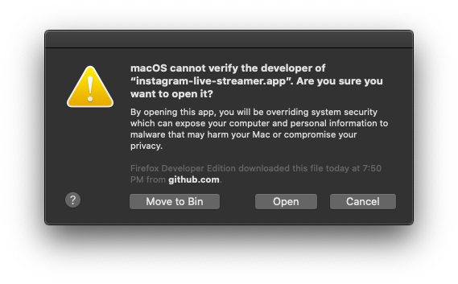

# Installation

## macOS
After your have downloaded the **instagram-live-streamer-x.x.x.dmg** file double click to open it

Drag the **"instagram-live-streamer.app"** into the **"Applications"** folder

After it finishes copying, open the **"Applications"** folder and find the **"instagram-live-streamer"** app.

"Right-Click" the app icon and select "Open"

A pop would show up saying its not signed. You can ignore the message for now and click on "Open"

## That's all. Happy Streaming!

