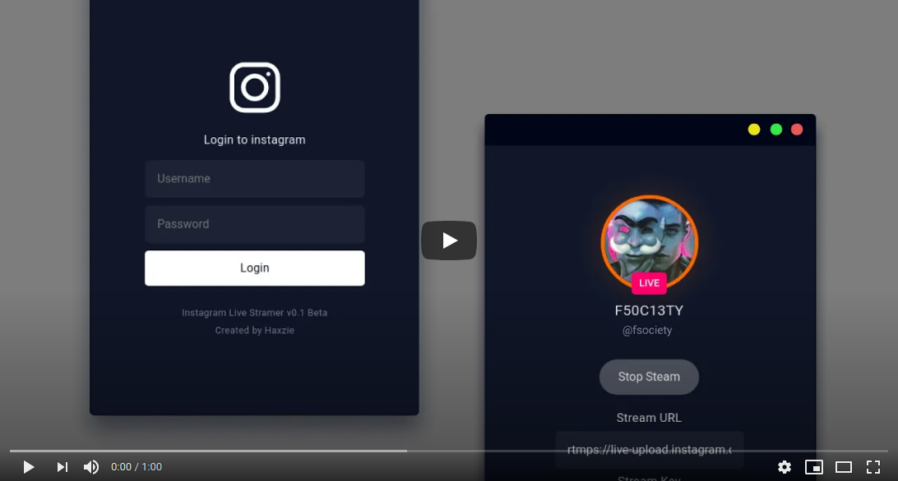

# Streamon - Instagram Live Streamer [UnOfficial]

> Stream to Instagram live from PC using OBS Studio or any streaming software.

**JOIN THE COMMUNITY - [Telegram](https://t.me/streamonhq) | [Twitter](https://twitter.com/streamonhq)**


## Download
> I am constantly updating and fixing things. Follow our [Twitter account](https://twitter.com/streamonhq) to stay in loop with all the new releases, fixes and security updates. To have a chat regarding features or collab, feel free to join our [Telegram channel](https://t.me/streamonhq)

Head over to the [downloads section of the website](https://ig-live.netlify.app/downloads)
> NOTE: Due to privacy concerns and due to Instagram's terms of services we are providing the app by removing all the branding of Instagram. We do not encourage you to redistribute the application due to this.

## Installation

### macOS

Please refer to [INSTALL.md](./INSTALL.md) file for further installation instructions


## Building the packages
Clone the project into your local machine and install the dependencies. Make sure you have latest version of Node, NPM and Python installed.

```bash
git clone https://github.com/haxzie/instagram-live-streamer.git
cd instagram-live-streamer
npm install
npm run build
```
### Linux
Run the following command to generate installable packages for linux (Debian/Ubuntu).
```bash
npm run dist:linux
```
The above command will generate installable `.deb` package in the `dist` sub directory of the project. You can cd into the folder and install the package using dpkg.
```bash
cd dist
sudo dpkg -i instagram-live-streamer_0.1.0_amd64.deb
```
### Windows
Run the following command to generate installable packages for Windows.
```bash
npm run dist:win
```
The above command will generate installable package in the `dist` sub directory of the project. You can then manually install the app using the installer

### MacOS
Run the following command to generate installable packages for MacOS.
```bash
npm run dist:mac
```
The above command will generate installable package in the `dist` sub directory of the project. You can then manually install the app using the installer
## Usage

- Open the application and sign in using your Instagram username and password.
  > Please note, we are not storing any of your credentials in any servers, this is completely a client-side application
- Click on Start Streaming and wait for the Stream URL and Stream Key to be populated
- Open any of your favorite streaming software, If you are using [OBS Studio](https://obsproject.com/) click on settings -> stream -> choose custom and copy paste the stream url and key from the app.
- Click on start streaming in OBS Studio
- In the application when you are ready, hit the `Go Live Button`

> Watch the video to get a better idea on how to setup instagram live streamer with OBS Studio

<center>
<a href="https://youtu.be/7F42Z0mBuok" target="_blank" rel="noopener"></a>
</center>

## Project Setup

This application uses Electron and React with [Instagram Private APIs](https://github.com/dilame/instagram-private-api/) thanks to [@dilame](https://github.com/dilame)

### Clone the project to your local machine

```bash
git clone https://github.com/haxzie/instagram-live-streamer.git
```

### Install dependencies

```bash
cd instagram-live-streamer
npm install
```

### Run the app in development mode

```bash
npm run electron-dev
```

## TODO

- [ ] Persist user session
- [ ] Live preview of the stream
- [ ] Ability to stream with out third party softwares
- [ ] Ability to see comments and live viewer count

## Disclaimer

This app or the creator is not associated or affiliated to Instagram. This is an unofficial application and stands no liability or warranty of usage. Use at your own risk.
